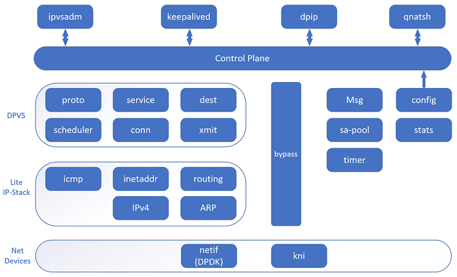
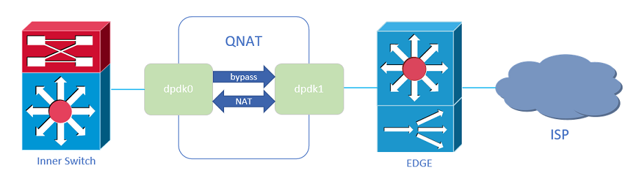

[English](https://github.com/Qihoo360/QNAT/blob/master/README.md) | [中文](https://github.com/Qihoo360/QNAT/blob/master/README_CN.md)

## Introduction
`QNAT` is a high-performance NAT (Network Address Translation) project base on [DPVS](https://github.com/iqiyi/dpvs) and [DPDK](http://dpdk.org) , mainly used in IDC (data center) or office network outlet. Support NAT44 , traffic bypass, multiple address pool selection, single IP session limit, NAT session logging, etc. We also added acommand-line interface function, allowing you to manage QNAT just like managing network devices.

## Environment Requirements
* `Linux Kernel version >= 2.6.34 （Need to support UIO and HUGETLBFS）`
* `DPDK version = 17.05.2`
* `GCC version >= 4.8.5`

## Test Environment
* `Linux Distribution: CentOS 7.2`
* `Kernel: 3.10.0-327.36.3.el7.x86_64`
* `CPU: Intel(R) Xeon(R) CPU E5-2630 v2 @ 2.60GHz`
* `NIC: Intel Corporation 82599ES 10-Gigabit SFI/SFP+ Network Connection (rev 01)`
* `Memory: 64G with two NUMA node`
* `GCC: gcc version 4.8.5 20150623 (Red Hat 4.8.5-4)`
* `DPDK: dpdk-stable-17.05.2`

## Architecture


## Installation/Configuration Instructions
+ ### Install Dependent Packages
```bash
$ yum install -y popt-devel.x86_64
$ yum install -y openssl-devel.x86_64
```
+ ### Get DPDK
```bash
$ wget https://fast.dpdk.org/rel/dpdk-17.05.2.tar.xz
$ tar vxf dpdk-17.05.2.tar.xz
```
+ ###  Build/Install DPDK
```bash
$ cd {path-of-dpdk}
$ make config T=x86_64-native-linuxapp-gcc
$ make -j12
$ echo export RTE_SDK=$PWD >> ~/.bashrc
$ source ~/.bashrc
``` 
+ ### Setup DPDK Hugepage
```bash
$ echo 12288 > /sys/devices/system/node/node0/hugepages/hugepages-2048kB/nr_hugepages
$ echo 12288 > /sys/devices/system/node/node1/hugepages/hugepages-2048kB/nr_hugepages
$ mkdir /mnt/huge
$ mount -t hugetlbfs nodev /mnt/huge
```
+ ### Bind DPDK NIC Driver
```bash
$ modprobe uio                                                    
$ insmod {path-of-dpdk}/build/kmod/igb_uio.ko                     
$ insmod {path-of-dpdk}/build/kmod/rte_kni.ko                     

$ {path-of-dpdk}/usertools/dpdk-devbind.py -s 
#get the UIO numbers of the network cards that need to be bound to the dpdk
#assume that the UIO numbers of eth0 is 0000:84:00.0, the UIO numbers of eth2 is 0000:84:00.1

$ ifconfig eth0 down ; ifconfig eth1 down                                        
$ {path-of-dpdk}/usertools/dpdk-devbind.py -b igb_uio 0000:84:00.0
$ {path-of-dpdk}/usertools/dpdk-devbind.py -b igb_uio 0000:84:00.1
```
+ ### Clone QNAT
```bash
$ git clone https://github.com/Qihoo360/qnat.git
```
+ ### Build/Install QNAT
```bash
$ cd QNAT
$ make -j12 
$ make install
```
+ ### Configuring QNAT
+ #### Configuring via command line

 >*Configuration example（Assume that the IP of the server's eth0 is 10.10.10.3/27, the IP of the server's eth1 is 110.110.110.2/28; 
 eth0 is configured as dpdk0, eth1 is configured as dpdk1）*
 ```bash
 $ qnatsh                                                          #Start the command line tool of QNAT
  ______    ______    ______          ______   _______    ______
 /      \  /      \  /      \        /      \ |       \  /      \
|  ######\|  ######\|  ######\      |  ######\| #######\|  ######\
 \##__| ##| ##___\##| ###\| ##      | ##  | ##| ##__/ ##| ##___\##
  |     ##| ##    \ | ####\ ##      | ##  | ##| ##    ## \##    \
 __\#####\| #######\| ##\##\##      | ##  | ##| #######  _\######\
|  \__| ##| ##__/ ##| ##_\####      | ##__/ ##| ##      |  \__| ##
 \##    ## \##    ## \##  \###       \##    ##| ##       \##    ##
  \######   \######   \######         \######  \##        \######

 nathost# ip nat start                                             #start QNAT service
 nathost# configure terminal                                       #enter the config node
 nathost(config)# hostname nattest                                 #mdify username
 nattest(config)#local ip 10.10.10.2/27                            #add ip for intranet
 nattest(config)#ip addr 10.10.10.3/27 dev dpdk0.kni               #add ip for dpdk0.kni
 nattest(config)#ip addr 110.110.110.2/28 dev dpdk1.kni            #add ip for dpdk1.kni
 nattest(config)#ip route 10.10.10.3/32 dev inside kni_host        #add route to kni device
 nattest(config)#ip route 110.110.110.2/32 dev outside kni_host    #add route to kni device
 nattest(config)#ip route 10.0.0.0/8 via 10.10.10.1 dev inside     #add route for back to intranet
 nattest(config)#ip route 0.0.0.0/0 via 110.110.110.1 dev outside  #add defaut route
 nattest(config)# ip nat pool default                              #create a nat address pool named default
 nattest(config-nat-pool)# member ip 110.110.110.5/28              #add ip member to the nat address pool
 nattest(config-nat-pool)# exit
 nattest(config)# ip nat source 10.0.0.0 10.255.255.255            #create a nat rule
 nattest(config-nat-service)# dest pool default
 nattest(config-nat-service)# end
 nattest# write file                                               #save configuration
```

+ #### Configuring through configuration file

>*Configuration example（Assume that the IP of the server's eth0 is 10.10.10.3/27, the IP of the server's eth1 is 110.110.110.2/28; 
 eth0 is configured as dpdk0, eth1 is configured as dpdk1）*
```bash
$ cat /etc/qnatcft.conf
local ip 10.10.10.2/27
ip addr 10.10.10.3/27 dev dpdk0.kni
ip addr 110.110.110.2/28 dev dpdk1.kni
ip route 10.10.10.3/32 dev inside kni_host
ip route 110.110.110.2/32 dev outside kni_host
ip route 10.0.0.0/8 via 10.10.10.1 dev inside
ip route 0.0.0.0/0 via 110.110.110.1 dev outside
hostname nattest
ip nat pool default
    member ip 110.110.110.5/28
exit
ip nat source 10.0.0.0 10.255.255.255
    dest pool default
exit

$ qnatsh                                                           #Start the command line tool of QNAT
  ______    ______    ______          ______   _______    ______
 /      \  /      \  /      \        /      \ |       \  /      \
|  ######\|  ######\|  ######\      |  ######\| #######\|  ######\
 \##__| ##| ##___\##| ###\| ##      | ##  | ##| ##__/ ##| ##___\##
  |     ##| ##    \ | ####\ ##      | ##  | ##| ##    ## \##    \
 __\#####\| #######\| ##\##\##      | ##  | ##| #######  _\######\
|  \__| ##| ##__/ ##| ##_\####      | ##__/ ##| ##      |  \__| ##
 \##    ## \##    ## \##  \###       \##    ##| ##       \##    ##
  \######   \######   \######         \######  \##        \######

nathost# ip nat start                                              #start QNAT service
nathost# load config                                               #load saved configuration
nattest# write file                                                #save configuration
```


## `QNATSH` Instructions
+ ### `QNATSH` Overview
`QNATSH` uses node level control to execute executable configuration commands, the node level includes enable node, config node, pool node, and service node.

+ ### Start `QNATSH`
`qnatsh`     （start without parameters）do not start the QNAT service, nor load saved configuration, enter enable node.

`qnatsh -b`  （start with parameters '-b'）start the QNAT service and load saved configuration, enter enable node.

+ ### Start/Stop `QNAT` Service
`ip nat start` start QNAT service without loading the configuration

`ip nat stop`  stop QNAT service

`load config`  load saved configuration

+ ### Command Line Description
                                                                                                                                    
|Command Line	                                          |Own node	    |Features                                                 |
|---------------------------------------------------------|-------------|---------------------------------------------------------|
|`end`                                                    |all nodes	|return enable node                                       |
|`exit`	                                                  |all nodes	|exit from current mode                                   |
|`write file`	                                          |all nodes	|save current configuration                               |
|`list`	                                                  |all nodes	|show current node executable commands                    |
|`config terminal`	                                      |enable node	|enter config node                                        |
|`show ip nat pool`	                                      |enable node	|show all nat address pool configurations                 |
|`show link stats`	                                      |enable node	|show nat link statistics                                 |
|`show local-ip`	                                      |enable node	|show local ip address                                    |
|`show nat`	                                              |enable node	|show nat service configuration information               |
|`show ospf interface`	                                  |enable node	|show information of the interface that can run ospf      |
|`show route`                                          	  |enable node	|show qnat routing table                                  |
|`show running-config`	                                  |enable node	|show the currently running configuration                 |
|`show startup-config`	                                  |enable node	|show the saved configuration                             |
|`hostname WORD`	                                      |config node	|configure hostname                                       |
|`ip addr A.B.C.D/M dev (dpdk0.kni|dpdk1.kni)`	          |config node	|configure the IP address of the kni interface            |
|`ip nat pool NAME`	                                      |config node	|configure nat address pool and enter pool node           |
|`ip nat source A.B.C.D A.B.C.D`	                      |config node	|configure nat service and enter service node             |
|`ip route A.B.C.D/M dev (inside|outside) [kni_host]`	  |config node	|configure route for kni device                           |
|`ip route A.B.C.D/M via A.B.C.D dev (inside|outside)`	  |config node	|configure route for qnat service                         |
|`local ip A.B.C.D/M`	                                  |config node	|configure local ip (intranet ip)                         |
|`no hostname`	                                          |config node	|cancel hostname setting                                  |
|`no ip addr A.B.C.D/M dev (dpdk0.kni|dpdk1.kni)`	      |config node	|cancel kni interface IP address setting                  |
|`no ip nat pool NAME`	                                  |config node	|cancel nat address pool setting and enter pool node      |
|`no ip nat source A.B.C.D A.B.C.D`	                      |config node	|cancel mat service setting and enter service node        |
|`no ip route A.B.C.D/M dev (inside|outside) [kni_host]`  |config node	|cancel kni device route setting                          |
|`no ip route A.B.C.D/M via A.B.C.D dev (inside|outside)` |config node	|cancel qnat service route setting                        |
|`no local ip A.B.C.D/M`	                              |config node	|cancel local ip (intranet ip) setting                    |
|`member ip A.B.C.D/M`	                                  |pool node	|configure nat address pool single IP member              |
|`member range A.B.C.D A.B.C.D masklen <0-32>`	          |pool node	|configure nat addrdss pool continuous IP address member  |
|`no member ip A.B.C.D/M`	                              |pool node	|cancel nat address pool single IP member setting         |
|`no member range A.B.C.D A.B.C.D`	                      |pool node	|cancel nat addrdss pool continuous IP address member     |
|`dest A.B.C.D/M`	                                      |service node	|configure the translation address of the NAT service     |
|`dest pool NAME`	                                      |service node	|configure the translation pool of the NAT service        |
|`no dest A.B.C.D/M`	                                  |service node	|cancel the NAT service translation address setting       |
|`no dest pool NAME`	                                  |service node	|cancel the NAT pool translation address setting          |

## Test QNAT
+ ### Test Topology
 

+ ### Test Conditions
  Need to use static/dynamic (default) routing or PBR (Policy Based Routing) to direct NAT traffic to the intranet NIC of the QNAT server.
  
+ ### Test Results
+ ##### NAT44
+ ##### Traffic ByPass
+ ##### Multiple Address Pool
+ ##### Single IP Session Limit
```bash
$ cat /etc/qnat/qnat_blk.conf
255.255.255.255=10000
$ tail -f /var/log/qnat_blk.log
```
+ ##### NAT Session Logging
```bash
$ tail -f /var/log/qnat.log
```

## Supplement
+ ### Reconfigure configration After System Reboot
```bash
$ echo 8192 > /sys/devices/system/node/node0/hugepages/hugepages-2048kB/nr_hugepages
$ echo 8192 > /sys/devices/system/node/node1/hugepages/hugepages-2048kB/nr_hugepages
$ modprobe uio                                                    
$ insmod {path-of-dpdk}/build/kmod/igb_uio.ko                     
$ insmod {path-of-dpdk}/build/kmod/rte_kni.ko                     
$ ifdown eth0; ifdown eth1                                        
$ {path-of-dpdk}/usertools/dpdk-devbind.py -b igb_uio 0000:84:00.0
$ {path-of-dpdk}/usertools/dpdk-devbind.py -b igb_uio 0000:84:00.1
```

## License
Main code of QNAT is [GNU General Public License, version 2 (GPLv2)](https://www.gnu.org/licenses/gpl-2.0.html) licensed.


## Other Dependencies:


* [DPVS](https://github.com/iqiyi/dpvs)

DPVS is a high performance Layer-4 load balancer based on DPDK. It's derived from Linux Virtual Server LVS and its modification alibaba/LVS.


* [Keepalived](http://www.keepalived.org/)

Keepalived is free software; you can redistribute it and/or modify it under the terms of the GNU General Public License as published by the Free Software Foundation; either version 2 of the License, or (at your option) any later version.

* [LVS/ipvsadm](http://www.linuxvirtualserver.org)

Linux Virtual Server kernel patches and related programs, released under the GNU General Public License (GPL).

* [DPDK](http://dpdk.org)

Main code of DPDK is BSD licensed and Linux kernel related parts are naturally licensed under the GPL.

* [LVS](http://www.linuxvirtualserver.org/)

Linux Virtual Server kernel patches and related programs, released under the GNU General Public License (GPL).

* [Linux Kernel](www.kernel.org)

Linux Kernel is available under GPL, see this [document](https://git.kernel.org/pub/scm/linux/kernel/git/torvalds/linux.git/plain/COPYING) for details.

* [Alibaba/LVS](https://github.com/alibaba/LVS)

Alibaba/LVS is based on LVS kernel components and related programs.

* [quagga](http://www.nongnu.org/quagga/)

Quagga Routing Software Suite, GPL licensed.

* [Consistent hashing](http://www.codeproject.com/Articles/56138/Consistent-hashing)

Consistent hashing library is BSD licensed.


## Contact Us
* QQ Group: 914897475


